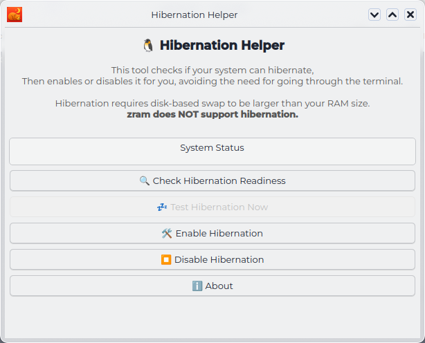

# Hibernation Helper

A modern, user-friendly GUI application to **enable, test, and disable hibernation** on Linux — without using the terminal.



> **No more `sudo` commands, `grubby` edits, or swap file calculations.**  
> Just click a button and hibernate safely.

---

## ✨ Features

- ✅ **Check readiness**: Detects RAM, swap (partition or file), and kernel config
- ✅ **Enable hibernation**:  
  - Auto-configures swap partitions  
  - Creates `/swapfile` if needed (with correct size)
- ✅ **Test hibernation**: One-click hibernate & resume
- ✅ **Disable hibernation**: Cleanly removes all changes
- ✅ **Fully secure**: Uses `pkexec` for authentication (no hardcoded root access)
- ✅ **Fedora-native**: Integrates with Plasma, uses system icons and policies
- ✅ **GPLv3 licensed**: Free and open source forever

---

## 📦 Installation

### Option 1: Install from RPM (Recommended)

1. Download the latest `.rpm` from [Releases](https://github.com/ChiefDenis/HibernationHelper/releases)
2. Install it:
   ```bash
   sudo dnf install ./hibernation-helper-*.rpm